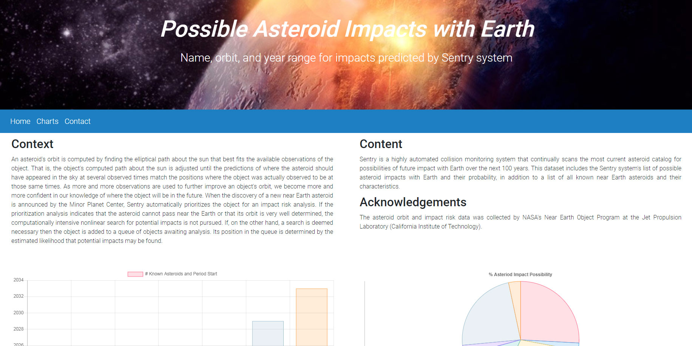
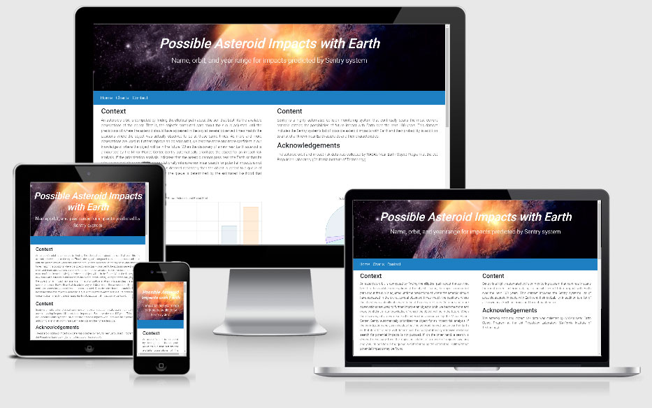

Over the last few years, the media has been very vocal about near earth objects and the proximity of them regarding the planet. So with the “Impact Earth” website, I have listed a number of known asteroids, the dates when they are due and other details regarding their size, speed and impact potential. 

#### The goals of this website are:

-   To give people information relating to potential issues with near earth objects
-   Give visitors an uncluttered, easy to use and graphically pleasing website experience
-   To allow visitors to request more information about this data via the contact form

#### The goals of this website are:

-   The visitor to be able to search for information about near earth objects.
-   Clear easy navigation.
-   Details information about the size, speed and the impact posibilities.

## UX

#### Ideal visitor

#### The ideal visitor for this website is:

-   English speaking.
-   Interested in space, science and near earth objects
-   Can understand and read charts  
-   Can use a contact form 

#### Visitors to this website are searching for:

-   Information related to near earth objects 
-   Information regarding the system that is used by NASA to monitor near earth objects called Sentry

#### This project is the best way to help them achieve these things because:

As this website is a general website, no particular colour scheme was required however, the header image does give the visitor an idea of what the website is about. 

-   Most websites do not offer charts to display statistical information.
-   The visitor also has the opportunity to contact the owner for more information 

#### This website is:

-   Easy to navigate.
-   Easy to understand and navigate the information.
-   Gives the visitor the general information.
-   Gives the visitor the option to send a request/query via the contact form.

#### viewer stories

1.  As a new visitor to the website, I want to easily navigate the site and understand the information 
2.  As a new visitor to the website, I want the ability to contact the owner should I need more information. 
7.  As an interested visitor, I want an "easy to fill" contact form, so I can make contact with website owner.
8.  As an interested visitor, I want to follow the owner on social media to keep up with their latest news.
9.  As a returning visitor to the website, who has already decided to contact the owner, I want to check for updates to the information.

#### Wireframe mockups:

* [Home Page](https://github.com/Scorptech/milestonetwo/blob/master/wireframe/wireframe.jpg)

After completing MS1, I decided to follow the same design for MS2 and have everything on one page (mobile first). 


## Features

The website has a static header image at the **Top** and also the **Social media Icons** at the bottom.  It features a responsive **navigation bar**. The website has a **footer** with **copyright information** and **social media icons** linking to 6 social media pages.

The website has **consistent design**.

#### Home

The Home page features a **static header image** which gives the visitor an idea of what the site is about when arriving to the website. The image is of an asteroid impacting the earth.

#### The Charts

The chart section features **Charts** displaying four different types of charts (Bar, Pie, Line and Horizontal Bar) with various details regarding seven asteroids.

Seeing statistical data in a simple chart format makes it easier to understand the information.

##### Contact
The Contact section features a **contact form**, which gives the visitor the option to leave a query/message. The bottom of the form contains a **Send Button**

The contact page form is working and was setup using the Emailjs free service and sends an email via an SMTP server to a predefined email address. 

### Existing Features

-   Header Navigation Bar - Allows all visitors to easily navigate website and find what they are looking for quickly.

-   Footer Copyright Info - Protects website copyright.

-   Footer Social Icons - Allows all visitors to access the social platforms that the owner uses.

-   The Charts - Allows visitors to see the information in an easy to understand format.

-   Contact Form - Allows visitors to ask questions, and/or make the first step with their queries.


### Features to Implement in future

-   GDPR compliant pop-up screen - Allows all new visitors to the website to approve or deny the processing of their personal data. Ensures the website complies with the EU data protection law.
-   Add CAPTCHA to contact form - Allows the website to protect the contact form from spam.
-   FAQ page, table with FAQs and dropdown buttons to view answers - Gives potential customers easy to find answers to their common questions.


## Technologies Used

- HTML
- CSS
- [jQuery](https://code.jquery.com)
- [Font Awesome](https://fontawesome.com)
- [Bootstrap](https://www.getbootstrap.com)
- [Google Fonts](https://fonts.google.com)
- [Popper.js](https://popper.js.org)
- [Emailjs](https://emailjs.com)

## Testing

Testing information can be found in a separate [Testing file](https://github.com/Scorptech/milestonetwo/blob/master/TESTING.md)


## Deployment

To deploy this page to GitHub Pages from its [GitHub repository](https://scorptech.github.io/milestonetwo/), the following steps were taken:

1.  Log into GitHub.
2.  From the list of repositories on the screen, select **Scorptech/milestonetwo**.
3.  From the menu items near the top of the page, select **Settings**.
4.  Scroll down to the **GitHub Pages** section.
5.  Under **Source** click the drop-down menu labelled **None** and select **Master Branch**
6.  On selecting Master Branch the page is automatically refreshed, the website is now deployed.
7.  Scroll back down to the **GitHub Pages** section to retrieve the link to the deployed website.

### How to run this project locally

To clone this project from GitHub:

1.  Follow this link to the Project GitHub repository ```https://github.com/Scorptech/milestonetwo.git```
2.  Under the repository name, click "Clone or download".
3.  In the Clone with HTTPs section, copy the clone URL for the repository.
4.  In your local IDE open your terminal.
5.  Change the current working directory to the location where you want the cloned directory to be made.
6.  Type `git clone`, and then paste the URL you copied in Step 3.

git clone repo ```https://github.com/Scorptech/milestonetwo.git```

7.  Press Enter. Your local clone will be created.

Further reading and troubleshooting on cloning a repository from GitHub [here](https://help.github.com/en/articles/cloning-a-repository).

### Acknowledgements/Credits

-   I received inspiration for this after seeing the main stream media mentioning near earth objects on a regular basis. 

-   [Simen Daehlin](https://www.github.com/Eventyret) originally suggested using chartjs after informing me that D3 charts were not responsive. 

-   Some bootstap and CSS Coding ideas came from [MD Bootstrap](https://mdbootstrap.com)

### Content

-   The text for the website was from NASA and proof-read/edited by [Alan Maher](www.linkedin.com/in/alanjmaher).


#### Disclaimer

-   This website is purely a mock up and was not designed to be a working website.  

Many thanks! 

Alan



